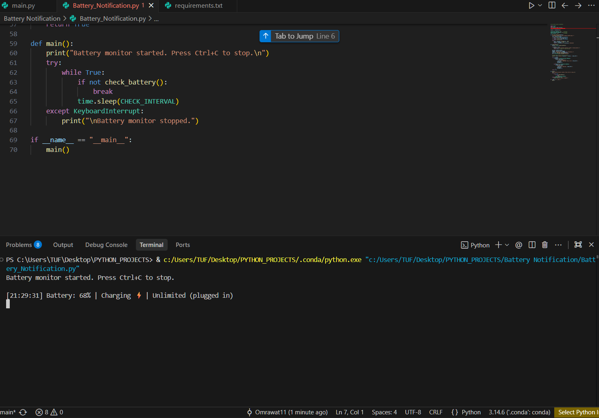
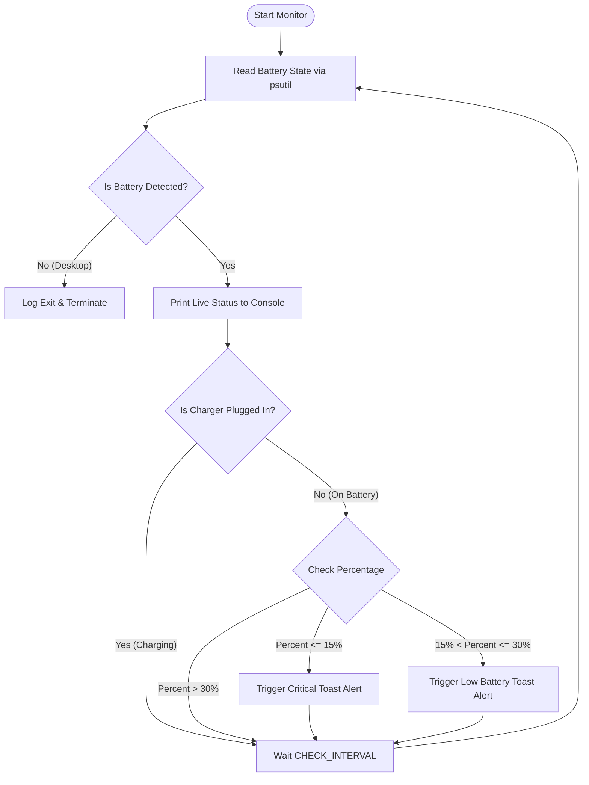

# 🔋 Smart Battery Notification System for Windows

<div align="center">


**A lightweight, real-time background battery monitor that sends native Windows 10/11 toast notifications before your laptop runs out of juice.**

[✨ Features](#-key-features) • [🛠️ Tech Stack & Dependencies](#-tech-stack--libraries-used) • [🚀 Quick Start](#-quick-start) • [⚙️ Configuration](#-configuration--customization) • [📊 How It Works](#-how-it-works)

---

</div>

## 📸 Preview

<div align="center">
  
</div>

---

## ✨ Key Features

- 🕒 **Real-Time Polling**: Continuously tracks battery percentage, power source, and estimated remaining time.
- ⚠️ **Multi-Tiered Alerts**:
  - **Low Battery Alert (≤ 30%)**: Friendly heads-up reminder with remaining time.
  - **Critical Alert (≤ 15%)**: High-priority alert advising you to plug in immediately.
- ⚡ **Smart Charging Detection**: Automatically disables alerts while plugged in and charging.
- 💻 **Clean Terminal Logs**: Formatted console logs with live timestamps and battery status.
- 🪶 **Ultra-Lightweight**: Minimal CPU and RAM footprint running quietly in the background.

---

## 🛠️ Tech Stack & Libraries Used

Here is a detailed breakdown of everything used in this project:

| Technology / Library | Type | Purpose in This Project |
| :--- | :--- | :--- |
| **[Python](https://www.python.org/)** `(>= 3.7)` | Core Language | Application logic, runtime, and timing loops |
| **[`psutil`](https://github.com/giampaolo/psutil)** | Third-Party Library | Fetches hardware sensor metrics (`psutil.sensors_battery()`), battery percentage, charging state (`power_plugged`), and estimated remaining time (`secsleft`) |
| **[`win10toast`](https://github.com/jithurjacob/Windows-10-Toast-Notifications)** | Third-Party Library | Displays native Windows 10/11 interactive toast popup notifications with custom titles, messages, and display durations |
| **`datetime`** | Built-in Module | Generates real-time timestamps (`HH:MM:SS`) for clean terminal logging |
| **`time`** | Built-in Module | Manages configurable polling intervals between sensor checks (`time.sleep`) |

---

## 🚀 Quick Start

### 1. Prerequisites
Ensure you have **Python 3.7+** installed on your Windows machine.
```bash
python --version
```

### 2. Installation

1. Navigate to the project directory:
   ```bash
   cd "Battery Notification"
   ```

2. Install the required dependencies:
   ```bash
   pip install -r requirements.txt
   ```

### 3. Run the Monitor
```bash
python Battery_Notification.py
```

> **Note**: Press <kbd>Ctrl</kbd> + <kbd>C</kbd> in your terminal anytime to stop the monitor gracefully.

---

## 📊 How It Works



---

## ⚙️ Configuration & Customization

<details>
<summary><b>🔧 Click to expand threshold and interval settings</b></summary>

<br>

You can easily adjust the thresholds inside [`Battery_Notification.py`](./Battery_Notification.py):

```python
LOW_BATTERY_THRESHOLD = 30       # Percentage to trigger first alert (e.g. 25, 30)
CRITICAL_BATTERY_THRESHOLD = 15  # Percentage to trigger urgent alert (e.g. 10, 15)
CHECK_INTERVAL = 60              # Check frequency in seconds (e.g. 30, 60, 120)
```

</details>

<details>
<summary><b>🔕 How to run silently in the background (No open CMD window)</b></summary>

<br>

1. **Option A: Rename extension to `.pyw`**
   - Rename `Battery_Notification.py` to `Battery_Notification.pyw`.
   - Double-click it to run silently in the background using `pythonw.exe`.
   - To stop it, open **Task Manager** and end the `pythonw.exe` process.

2. **Option B: Run on Windows Startup**
   - Press <kbd>Win</kbd> + <kbd>R</kbd>, type `shell:startup`, and hit **Enter**.
   - Create a shortcut to `Battery_Notification.pyw` in that folder.
   - The notification monitor will now start automatically whenever your PC boots!

</details>

---

## ❓ Troubleshooting & FAQs

<details>
<summary><b>Q: It says "No battery detected. Exiting monitor."</b></summary>
<br>
This happens if you are running the script on a Desktop PC without a battery, or on a Virtual Machine without virtual battery passthrough.
</details>

<details>
<summary><b>Q: Toast notifications are not popping up?</b></summary>
<br>
Check Windows <b>Focus Assist / Do Not Disturb</b> settings in Windows Settings → System → Notifications. Ensure notifications are enabled for Python/scripts.
</details>

---

## 🗺️ Roadmap & Checklist

- [x] Real-time battery percentage monitoring
- [x] Windows native toast notifications
- [x] Charging status detection
- [x] Time remaining estimation
- [ ] Sound alert option for critical battery levels
- [ ] Custom system tray icon menu
- [ ] Fully customizable notification thresholds via GUI or `.env` file

---

## 📄 License

Distributed under the **MIT License**. See `LICENSE` for more information.

<div align="center">
  <sub>Made with ❤️ for better laptop battery management.</sub>
</div>
